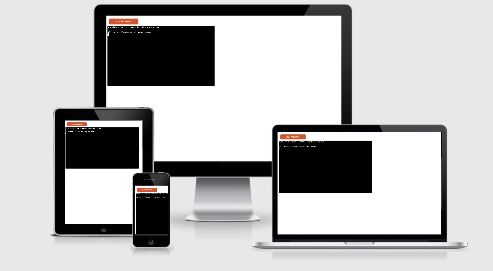
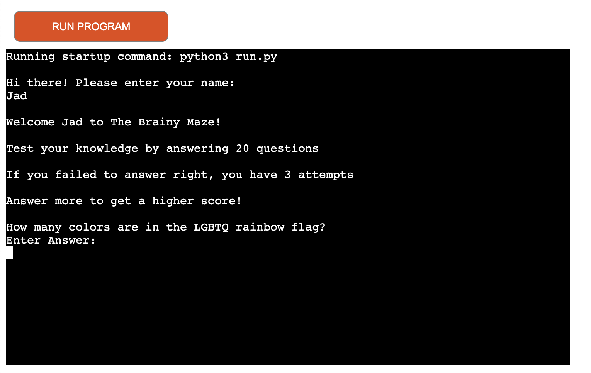
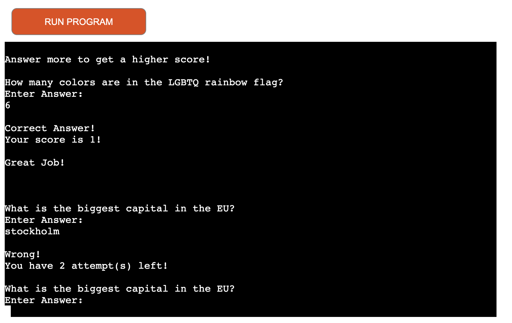
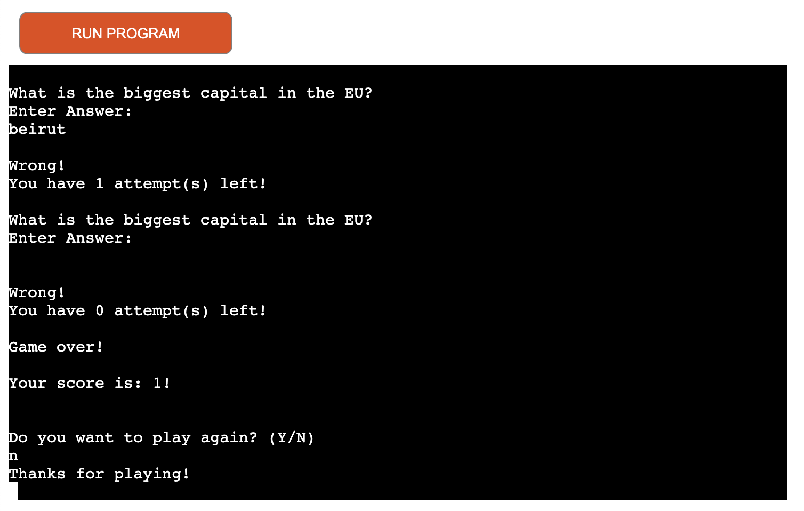

# Portfolio Project 3 - Brain Maze
## Purpose

Brain Maze is a Python terminal game, which runs in the Code Institute mock terminal on Heroku.

The users can test their knowledge by answering 20 different questions.

This program was created for the purpose of completing the Portfolio 3 project for the Code Institute's Full Stack Developer course and is entirely fictional.
The project covers Python with a user centric approach in mind.  A full list of technologies used can be found in the technologies section of this document.

Here is the live version of my project. [here](https://brain-maze.herokuapp.com/)

### Languages used
* Python 3
	* This project uses Python as the main language.

### How to play?

The user have to answer 20 questions, with 3 attempts for each question.
All correct answers will be additioned to give them a score over 20

### Features:

## Existing Features
- The user enter their name to give more of a user experience and his/her name will be used throughout the game.

- Library of Q/A
- The program check answers if correct and give attempts if incorrect
- scoring based on correct answers

- Game Over in case of failed attempts

- Ask the user if they would like to play again

## Future features:
- Create a puzzle with an X character that moves toward the finish line for user to win.
- Have a score board displayed by the end of the game for each player to know their rank.

### Testing

I have manually tested this project by doing the following:
- Passed the code through a PEP8 linter and confirmed there are no problems.
- Tested in my local terminal and the Code Institute Keroku terminal.

### Bugs
## Solved Bugs
- I had a problem breaking the code with the 3rd attempt, but I solved after realizing that I needed to break after the print(), not before

## Remaining Bugs
- No bugs remaining

## Validator Testing
- PEP8
    - No errors were returned from PEP8online.com

### Deployment

This project was deployed using Code Institute's mock terminal for Heroku.
- Steps for deployment:
    - Fork or clone this repository
    - Create a new Heroku app
    - Set the buildbacks to Python and NodeJS in that order
    - Link the Heroku app to the repository
    - Click on Deploy

### Frameworks, Libraries & Programs used
* [GitHub](https://github.com/)
	* GithHub is the hosting site used to store the source code for the Website and [Git Pages](https://pages.github.com/) is used for the deployment of the live site.
* [GitPod](https://gitpod.io/)
	* GitPod is used as version control software to commit and push code to the GitHub repository where the source code is stored.
* [Am I Responsive?](http://ami.responsivedesign.is/)
	* Used to generate the screenshots for responsive design.

### Credits
- Code Institute for the deployment terminal
- To my Mentor [Chris Quinn](https://github.com/10xOXR) who has been an exceptional help throughout the course, so far.
